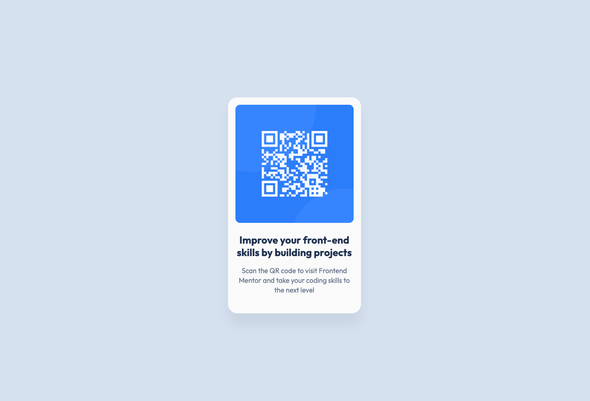

# Frontend Mentor - QR code component solution

This is a solution to the [QR code component challenge on Frontend Mentor](https://www.frontendmentor.io/challenges/qr-code-component-iux_sIO_H). Frontend Mentor challenges help you improve your coding skills by building realistic projects. 

## Table of contents

- [Overview](#overview)
  - [Screenshot](#screenshot)
  - [Links](#links)
- [My process](#my-process)
  - [Built with](#built-with)
  - [What I learned](#what-i-learned)
  - [Continued development](#continued-development)
  - [Useful resources](#useful-resources)
- [Author](#author)
- [Acknowledgments](#acknowledgments)

## Overview

### Screenshot

### Links

- Solution URL: [Add solution URL here](https://github.com/soycanopa/fm-qr-code-component)
- Live Site URL: [Add live site URL here](https://soycanopa.github.io/fm-qr-code-component/)

## My process

### Built with

This was a project built from scratch, a simple project but one that allows me to practice muscle memory, which is super necessary to continue progressing. Now, the technologies I used in this development or challenge were:

- Semantic HTML5 markup
- CSS custom properties
- CSS Variables
- Flexbox

### What I learned

In this challenge, I learned how to use CSS variables to avoid having to change properties one by one and to make the work as scalable as possible. Additionally, I tried to keep everything well documented by using comments and organizing my code in the best way so that when I return to it, it’s easy to understand how I did everything.

Another thing I learned was how to use Figma as a support tool to define many CSS styles for the challenge. Although it seemed very unintuitive at first, I understood the process within a few minutes. Since it was my first time, I felt a bit intimidated.

### Continued development

I will continue to keep it basic initially. All these challenges allow me to practice two things I know I need to improve: CSS and the use of Flexbox. I hope that in future challenges I can keep playing a little more with these properties. Also, with constant practice, I hope to become increasingly skilled in using CSS because there are no limits to my imagination. But, at the start, we don't want to rush; we want to take gentle but firm steps.

## Author

- Website - [Carlos Andres O. P.](https://bento.me/soycanopa)
- Frontend Mentor - [@soycanopa](https://www.frontendmentor.io/profile/soycanopa)
- Linkedin - [@soycanopa](https://www.linkedin.com/in/soycanopa/)
